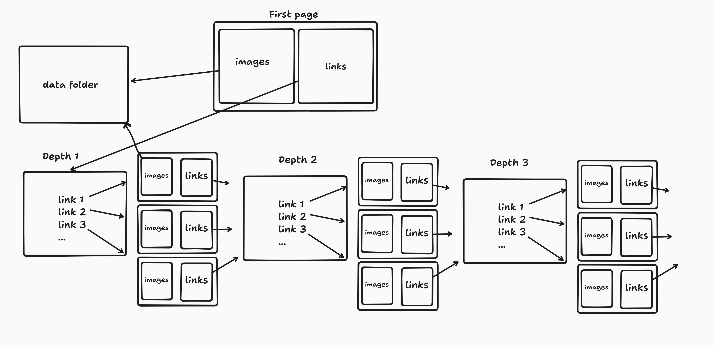

# 🕷️ Arachnida Scraper - Image Downloader - EXIF Extractor

This `SPIDER` script downloads image files from a given URL. It supports recursive downloading with configurable depth and allows specifying the output path.

this `SCORPION` script extract exif metadata from a given image.



## 📦 Features

- Download images from a single target URL (`spider`)
- Recursively crawl and download from linked pages (`-r`) (`spider`)
- Set recursion depth (`-l [N]`, default: 5) (`spider`)
- Choose where to save the downloaded files (`-p [PATH]`, default: `./data/`) (`spider`)
- Supported image extensions: `.jpg`, `.jpeg`, `.png`, `.gif`, `.bmp` (`spider`)
- Extract EXIF metadata from downloaded images (`scorpion`)
- Display EXIF information such as camera details, geolocation, etc. (`scorpion`)
- Option to save or display EXIF thumbnail (`scorpion`)


---

## 🚀 How to Run

### 1. Clone the Repository

```bash
git clone https://github.com/Nouakchi/arachnida_scraper.git arachnida_scraper
cd arachnida_scraper
```
### 2. Create a Virtual Environment

```bash
python3 -m venv venv
source venv/bin/activate
```

### 3. Install Dependencies

```bash
pip install -r modules/requirements.txt
```

## 🧪 Usage

python spider.py [OPTIONS] URL

✅ Options
Option	Description
-r	Recursively download images linked from the given URL
-r -l [N]	Specify the maximum depth of recursion (default is 5)
-p PATH	Specify the directory to save downloaded images (default is ./data/)
🔍 Example

python spider.py -r -l 2 -p ./images http://example.com

This command downloads all images from http://example.com, including images from pages linked up to 2 levels deep, and saves them in the ./images/ directory.

## 📁 Example Project Structure
```bash
python-spider/
├── assets
│   ├── banner.png
│   ├── test1.jpg
│   ├── test2.jpg
│   └── test3.jpg
├── modules
│   └── requirements.txt
├── README.md
├── scripts
│   ├── scorpion.py
│   └── spider.py
└── src
    ├── 1.html
    ├── 2.html
    └── 3.html

```

## 🛠️ Requirements

    Python 3.6 or higher

    Required Python packages listed in requirements.txt

👨‍💻 Author

Made with ❤️ by Othmane Nouakchi
Feel free to contribute or report issues!
